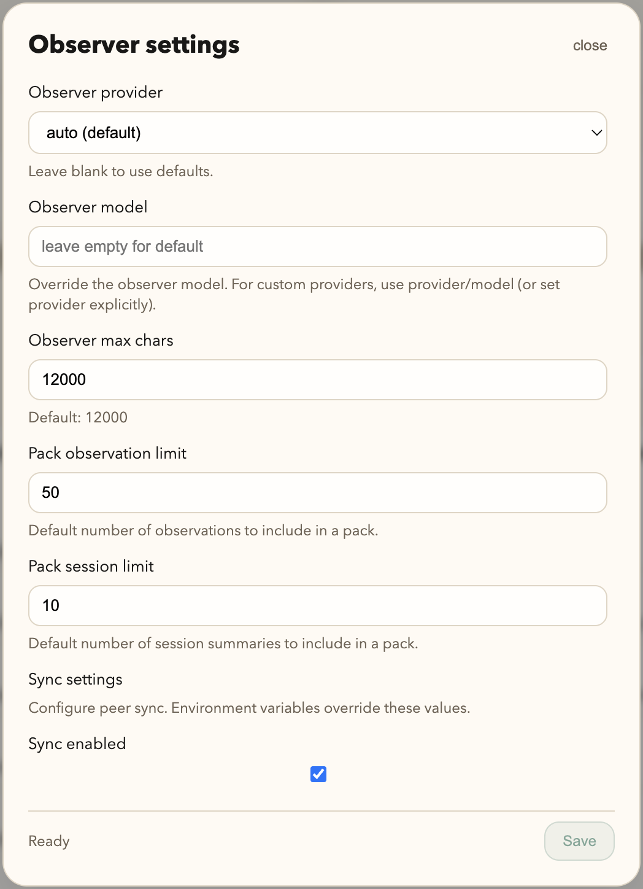

# Plugin Reference

This page covers advanced plugin behavior, environment variables, and stream reliability controls.

## Observer and settings UI



## Running OpenCode with the plugin

1. Start OpenCode inside this repo (or make the plugin global so it globs in everywhere).
2. Every tooling session creates memory artifacts in SQLite.
3. Prompt-time memory injection appends volatile recall output to the latest user message by default, preserving the stable system/history prefix for provider prompt caches.
4. Use `codemem stats` and `codemem recent` to confirm ingestion.
5. Browse the viewer at the printed URL.

OpenCode prompt-time pack construction and prompt-pack ledger transitions use the
long-lived local viewer first. Retryable connection, timeout, endpoint-version,
server, or malformed-response failures fall back to the compatible CLI path.
Validated request errors are terminal and do not spawn a fallback command. The
HTTP timeout uses `CODEMEM_INJECT_HTTP_MAX_TIME_S` (default: 2 seconds).
Pack and ledger requests include their resolved default or explicit database,
identity/config, compression, and embedding targets. The viewer also rejects a cached store
identity that no longer matches current database/config resolution. A mismatch
uses the CLI fallback instead of accepting context from another local profile.
Arbitrary 4xx responses from a process on the viewer port also fall back; only
structured Codemem validation errors are terminal. A payload-free profile
handshake runs before each POST, and Fetch redirects are disabled so prompt-derived
request bodies are not replayed to another endpoint.

## Claude marketplace install

CodeMem's Claude integration is hook-first and distributed through a Claude plugin marketplace source in this repo (`.claude-plugin/marketplace.json`).

In Claude Code, add the marketplace and install the plugin:

```text
/plugin marketplace add kunickiaj/codemem
/plugin install codemem
```

The plugin starts MCP with the TS CLI:

- `codemem mcp`

Claude hooks run the packaged standalone Node runtime. It applies project policy and redaction before sending normalized events to the local daemon RPC socket; when RPC is unavailable, the same redacted event is written to the bounded atomic spool:

- `codemem claude-hook-ingest`

Hook clients never open SQLite. Claude's outer watchdog is 3 seconds; the client uses a shorter RPC cutoff so the spool has a reserved completion window.

You can update an existing marketplace install with:

```text
/plugin marketplace update codemem-marketplace
```

The CLI keeps a compatible manual stdin entry point:

```bash
printf '%s\n' '{"hook_event_name":"SessionStart","session_id":"sess-1","cwd":"/tmp/demo"}' | codemem claude-hook-ingest
```

Prompt-time context and file-context reads use daemon RPC. `UserPromptSubmit` performs recall and event delivery in one hook invocation; `SessionEnd` is delivered through the same RPC-or-spool path as other events.

The packaged template currently registers these hook events in `plugins/claude/hooks/hooks.json`:
- `SessionStart`
- `UserPromptSubmit`
- `PreToolUse` (`Read` only)
- `PostToolUse`
- `PostToolUseFailure`
- `Stop`
- `SessionEnd`

`UserPromptSubmit` runs `scripts/hook-runtime.mjs claude-hook-inject`, which requests a context pack over daemon RPC while delivering the normalized prompt event. Failures return a continue response and never block the Claude session.

For Claude hooks, project resolution precedence is:

1. `CODEMEM_PROJECT` (if set)
2. repo/cwd-derived project name (`resolve_project(cwd)`)
3. payload `project` fallback (only when cwd is unavailable)

`PreToolUse:Read` requests the existing per-file observation timeline over daemon RPC. Retrieval attempts and delivery status remain recorded in the daemon-owned retrieval ledger.

## Codex integration (early beta)

Codex support is early beta — functional and dogfooded end-to-end, but not yet promoted to a stable support tier. The Codex plugin uses the same shared raw-event pipeline as Claude and OpenCode. It is packaged under `plugins/codex/` with `.codex-plugin/plugin.json`, bundled `.mcp.json`, and hook scripts under `plugins/codex/scripts/`.

Codex hooks use the same standalone runtime, daemon RPC, redaction, and bounded atomic spool as Claude. Hook clients never open SQLite. The Codex outer watchdog is 5 seconds.

```bash
printf '%s\n' '{"hook_event_name":"SessionStart","session_id":"codex-1","cwd":"/tmp/demo"}' | codemem codex-hook-ingest
```

`UserPromptSubmit` runs `scripts/hook-runtime.mjs codex-hook-inject`, which requests a context pack and delivers the prompt event concurrently over daemon RPC. The injected pack is framed as codemem reference data, not instructions, before it is returned as Codex `additionalContext`. It honors `CODEMEM_INJECT_CONTEXT`, `CODEMEM_INJECT_LIMIT`, `CODEMEM_INJECT_TOKEN_BUDGET`, and `CODEMEM_INJECT_MAX_CHARS`. Hook failures always emit `{"continue": true}` so Codex sessions are never blocked.

```bash
printf '%s\n' '{"hook_event_name":"UserPromptSubmit","session_id":"codex-1","prompt":"what did we change","cwd":"/tmp/demo"}' | codemem codex-hook-inject
```

For Codex hooks, project resolution precedence matches the Claude hook path:

1. `CODEMEM_PROJECT` (if set)
2. repo/cwd-derived project name
3. payload `project` fallback (only when cwd is unavailable)

`Stop` events map the inline `last_assistant_message` when present, and fall back to the last assistant message in `transcript_path` so final responses are captured even when the inline field is omitted.

The packaged Codex template registers `SessionStart`, `UserPromptSubmit`, `PostToolUse`, `Stop`, and `SessionEnd` in `plugins/codex/hooks/hooks.json`. Codex support is early beta; see `docs/plans/2026-05-28-codex-first-class-integration.md` for the rollout plan and validation gates.

### Install, update, and uninstall

Install through Codex's own plugin marketplace — there is no `codemem setup` step:

```bash
codex plugin marketplace add https://github.com/kunickiaj/codemem.git
codex plugin add codemem@codemem
# refresh the marketplace snapshot later:
codex plugin marketplace upgrade
# remove:
codex plugin remove codemem@codemem
```

The plugin bundles `.mcp.json` (`npx -y codemem mcp`) and `hooks/hooks.json`. Hook scripts call `codemem` from `PATH` and fall back to `npx -y codemem@<plugin version>`, so a global CLI is optional but reduces hook latency. Validated targets: Codex CLI 0.135+ and current Desktop builds.

### Plugin-free install (`codemem setup --codex-only`)

API-key / non-subscription Codex Desktop greys out plugin installation. For that case, configure Codex directly — no marketplace, no plugin:

```bash
npx -y codemem setup --codex-only   # or, with a global install: codemem setup --codex-only
```

What it does (idempotent; honors `CODEX_HOME`; backs up existing files; `--force` to refresh):

- **MCP:** appends `[mcp_servers.codemem]` (`command = "npx"`, `args = ["-y", "codemem", "mcp"]`) to `<CODEX_HOME>/config.toml` if not already present. The file is never reparsed or reformatted — only appended — so comments and unrelated servers (including secrets) are preserved.
- **Hooks:** installs the bundled runtime as `<CODEX_HOME>/codemem-hook-runtime.mjs` (mode `0600`) and merges `SessionStart`, `UserPromptSubmit`, `PostToolUse`, `Stop`, and `SessionEnd` into `<CODEX_HOME>/hooks.json`, preserving unrelated user hooks. `UserPromptSubmit` uses one combined capture/recall hook. Existing legacy codemem hook groups are migrated on a normal rerun.

Hooks loaded from the user config layer require a one-time trust approval in Codex (you'll be prompted on first run; MCP recall needs no trust). Codex setup also runs automatically in a plain `codemem setup` when a Codex home (`~/.codex` or `$CODEX_HOME`) is detected.

### Troubleshooting

- **No memories and no raw events captured.** Confirm `<CODEX_HOME>/hooks.json` points to `<CODEX_HOME>/codemem-hook-runtime.mjs`, then check daemon health. Hook failures are fail-open and RPC failures enter the shared `control/spool/ready` queue under the configured data directory.
- **Spool backlog drains automatically** when the daemon starts and during its periodic sweep. A retained backlog means the daemon is unavailable or rejecting the normalized event; inspect daemon health/doctor output and `~/.codemem/plugin.log`.
- **A model rejects injected context** (for example "the conversation must end with a user message"): disable prompt-time injection with `CODEMEM_INJECT_CONTEXT=0`. Capture/ingest keeps working and recall is still available through the MCP tools.

## Post-restart config sanity checklist

After restarting OpenCode or the viewer, run this quick check when behavior looks off:

1. Confirm plugin + viewer are talking to the same DB path.
2. Check backend stats and recent writes (`codemem stats`, `codemem recent`).
3. Verify runner mode and source (`CODEMEM_RUNNER`, `CODEMEM_RUNNER_FROM`) match your install strategy.
4. Confirm injection controls are what you expect (`CODEMEM_INJECT_CONTEXT`, `CODEMEM_INJECT_LIMIT`, `CODEMEM_INJECT_TOKEN_BUDGET`).
5. If stream mode is enabled, check backlog health (`codemem db raw-events-status`).

If needed, restart viewer + plugin flow:

```bash
codemem serve restart
```

If you override the viewer bind, keep the plugin and viewer aligned on the same target:

```bash
set -lx CODEMEM_VIEWER_HOST 127.0.0.1
set -lx CODEMEM_VIEWER_PORT 38892
```

The plugin now passes that explicit host/port through when it auto-starts, health-checks, stops, or restarts the viewer. Its liveness monitor requires a successful `GET /api/health` JSON response identifying `service: "codemem-viewer"`; `ready: false` still means the viewer process is live. For compatibility, only a `404` from the health route triggers one bounded probe of the legacy raw-event status endpoint. Raw-event ingest availability keeps its separate preflight behavior, now bounded by a 5-second timeout so a hung viewer socket cannot stall event delivery. Do not run multiple viewers against the same DB/runtime folder unless they intentionally share the same bind target; otherwise `viewer.pid` ownership becomes ambiguous.

If compatibility toasts appear after restart, follow the runner-specific guidance in Compatibility guidance behavior below.

## Plugin tools exposed to the model

- `mem-status` - show viewer URL, log path, stats, and recent entries.
- `mem-stats` - show just the stats block.
- `mem-recent` - show recent items (defaults to 5).

These are plugin tools callable by the agent/runtime. They are not user-facing
slash commands in the OpenCode chat input.

## MCP tools exposed to agents

The stdio MCP process is a thin daemon RPC client and never opens SQLite. Phase 1
exposes `memory_search`, `memory_search_index`, `memory_recent`, `memory_timeline`,
`memory_expand`, `memory_explain`, `memory_get`, `memory_get_observations`,
`memory_pack`, `memory_schema`, `memory_remember`, and `memory_status`.

Read calls fail with typed `daemon_unavailable` output while the daemon is down.
`memory_remember` is pre-redacted and queued to the shared atomic spool instead.
User-authority tools such as forget, confirm, pin, retract, and destructive bulk
actions are not registered for agents.

Example agent requests:

- "Find recurring project lessons worth adding to AGENTS.md."
- "Run distill for all projects and show top candidates."
- "Distill without judging so I can see the raw recurrence ranking."

## Observer model defaults

- OpenAI: `gpt-5.4-mini`
- Anthropic: `claude-4.5-haiku` (mapped to Anthropic direct API alias `claude-haiku-4-5` when using `api_http`)

Provider/model selection can be overridden with `CODEMEM_OBSERVER_PROVIDER` and
`CODEMEM_OBSERVER_MODEL`. Custom providers are loaded from OpenCode config.

### Observer auth modes

Observer execution uses the `api_http` runtime. The default OpenAI model is
`gpt-5.4-mini` unless `observer_model` is set.

- Anthropic direct API calls accept Anthropic model IDs/aliases; use `claude-haiku-4-5-20251001` if you need a pinned snapshot instead of the moving alias.
- Supported auth sources: `auto`, `env`, `file`, `none`. Automatic resolution follows explicit key → environment → file.
- Supported: API keys and gateway tokens codemem can read directly.
- Custom provider path does not implicitly fall back to unrelated environment tokens; use the provider key, `CODEMEM_OBSERVER_API_KEY`, or `file`.
- For codemem-native custom providers, set `observer_base_url` (or `CODEMEM_OBSERVER_BASE_URL`) to avoid relying on OpenCode provider config.

For gateway auth, configure a token file plus templated headers:

```json
{
  "observer_provider": "your-gateway-provider",
  "observer_base_url": "https://gateway.example/v1",
  "observer_auth_source": "file",
  "observer_auth_file": "/path/to/gateway-token",
  "observer_auth_cache_ttl_s": 300,
  "observer_headers": {
    "Authorization": "Bearer ${auth.token}"
  }
}
```

Header template variables:

- `${auth.token}`
- `${auth.type}`
- `${auth.source}`

Token-file cache behavior:

- Successful token resolutions are cached for `observer_auth_cache_ttl_s`.
- Failed token resolutions are not cached.

## Stream-only mode (advanced)

Stream contract:
- Preflight availability: `GET /api/raw-events/status`
- Event streaming: `POST /api/raw-events`
- Non-2xx and network failures are treated as stream failures.
- Raw events are delivered through the viewer ingest API.
- Raw-event batches accepted by the viewer are retried by the sweeper flush workers.
- If the direct CLI fallback reports an explicit SQLite busy/locked result or command timeout, the plugin retries it once with the same event ID. Other failures are reported and dropped rather than requeued or spooled, and logs retain only a bounded failure category rather than raw command output.

Suggested settings:

```bash
export CODEMEM_RAW_EVENTS_AUTO_FLUSH=1
export CODEMEM_RAW_EVENTS_DEBOUNCE_MS=60000
export CODEMEM_RAW_EVENTS_SWEEPER=1
export CODEMEM_RAW_EVENTS_SWEEPER_IDLE_MS=120000
export CODEMEM_RAW_EVENTS_SWEEPER_LIMIT=25
export CODEMEM_RAW_EVENTS_STUCK_BATCH_MS=300000
# optional retention
# export CODEMEM_RAW_EVENTS_RETENTION_MS=$((7*24*60*60*1000))
```

To monitor backlog:

```bash
codemem db raw-events-status
```

If `raw-events-status` shows `batches=error:N` (legacy label) or `queue=... failed:N` for a stream, retry:

```bash
codemem db raw-events-retry <session_stream_id>
```

## Hook lifecycle and flush boundaries

The plugin uses OpenCode event hooks and flushes on explicit lifecycle boundaries:

- `tool.execute.after`: queue tool event; contributes to force-flush thresholds.
- `session.idle`: immediate flush attempt.
- `session.created`: flush previous session buffer before switching context.
- `/new` prompt boundary: flush before session reset.
- `session.error`: immediate flush attempt.

Force-flush thresholds (immediate flush):
- `>=50` tool events, or
- `>=15` prompts, or
- `>=10` minutes session duration.

Failure semantics:
- Stream POST failures are backoff-gated in plugin runtime (`CODEMEM_RAW_EVENTS_BACKOFF_MS`).
- Availability checks are rate-limited (`CODEMEM_RAW_EVENTS_STATUS_CHECK_MS`).
- Accepted raw-event batches are retried by viewer/store queue workers (`codemem db raw-events-retry`).

## Project label normalization

When ingesting plugin payloads, CodeMem stores a normalized project label instead of a full path.

- Path-like labels are reduced to the basename (for example, `/Users/adam/workspace/codemem` -> `codemem`).
- Windows-style paths are normalized with Windows path rules on every OS runtime.
  - `C:\Users\adam\workspace\codemem` -> `codemem`
  - `D:/dev/client-demo` -> `client-demo`
  - `\\server\share\team\project-x` -> `project-x`
- `CODEMEM_PROJECT` still has highest precedence and is normalized the same way.

### Multi-adapter project unification

If you run multiple adapters for the same project (for example OpenCode + Claude), set a shared `CODEMEM_PROJECT` value in both runtimes to guarantee unified project grouping in memory retrieval.

## Environment hints

| Env var | Description |
| --- | --- |
| `CODEMEM_RUNNER` | Override auto-detected runner: `codemem` (global), `npx`, `node` (repo/dev), or custom binary name. |
| `CODEMEM_RUNNER_FROM` | Runner source override: npm package spec for `npx` (for example `codemem@0.20.0-alpha.7`), or repo/CLI entry path for `node`. |
| `CODEMEM_VIEWER` | Set to `0`, `false`, or `off` to disable the viewer entirely. |
| `CODEMEM_VIEWER_HOST`, `CODEMEM_VIEWER_PORT` | Explicit host/port the plugin-managed viewer should start, probe, stop, and restart. |
| `CODEMEM_VIEWER_AUTO` | Set to `0`/`false`/`off` to disable auto-start (default on). |
| `CODEMEM_VIEWER_AUTO_STOP` | Set to `0`/`false`/`off` to keep the viewer running after OpenCode exits (default on). |
| `CODEMEM_PLUGIN_LOG` | Path for the plugin log file (set `1`/`true`/`yes` for `~/.codemem/plugin.log`; Claude hook failures are logged to this path by default). |
| `CODEMEM_PLUGIN_LOG_PATH` | Explicit log file path for Claude hook script logging (overrides `CODEMEM_PLUGIN_LOG` for that script). |
| `CODEMEM_INJECT_HTTP_MAX_TIME_S` | Viewer request timeout for OpenCode packs and ledger transitions (default `2` seconds). Claude/Codex hooks use daemon RPC deadlines instead. |
| `CODEMEM_INJECT_MAX_CHARS` | Max chars returned as Claude/Codex `additionalContext` (default `16000`). |
| `CODEMEM_PLUGIN_CMD_TIMEOUT` | Milliseconds before a plugin CLI call is aborted (default `20000`). |
| `CODEMEM_MIN_VERSION` | Minimum required CLI version for plugin compatibility warnings (default `0.9.20`). |
| `CODEMEM_BACKEND_UPDATE_POLICY` | Backend update behavior on compatibility mismatch: `notify` (default), `auto`, or `off`. |
| `CODEMEM_PLUGIN_DEBUG` | Set to `1`, `true`, or `yes` to log plugin lifecycle events. |
| `CODEMEM_PLUGIN_IGNORE` | Skip all plugin behavior for this process. |
| `CODEMEM_INJECT_CONTEXT` | Set to `0` to disable memory pack injection (default on). |
| `CODEMEM_INJECT_SURFACE` | OpenCode injection surface: `message` by default; set `system` for the legacy system-prompt transform. |
| `CODEMEM_INJECT_LIMIT` | Max memory items in injected pack (default `8`). |
| `CODEMEM_INJECT_TOKEN_BUDGET` | Approx token budget for injected pack (default `800`). |
| `CODEMEM_USE_OPENCODE_RUN` | Use `opencode run` for observer generation (default off). |
| `CODEMEM_OPENCODE_MODEL` | Model for `opencode run` (default `gpt-5.1-codex-mini`). |
| `CODEMEM_OPENCODE_AGENT` | Agent for `opencode run` (optional). |
| `CODEMEM_OBSERVER_PROVIDER` | Force `openai`, `anthropic`, or a custom provider key (optional). |
| `CODEMEM_OBSERVER_MODEL` | Override observer model (default `gpt-5.4-mini` or `claude-haiku-4-5`). |
| `CODEMEM_OBSERVER_API_KEY` | API key for observer model (optional). |
| `CODEMEM_OBSERVER_AUTH_SOURCE` | Observer auth source (`auto`, `env`, `file`, `none`). |
| `CODEMEM_OBSERVER_AUTH_FILE` | Path to token file used when auth source is `file`. |
| `CODEMEM_OBSERVER_AUTH_CACHE_TTL_S` | Cache TTL for token-file auth resolution in seconds (default `300`). |
| `CODEMEM_OBSERVER_HEADERS` | JSON object of templated observer headers, e.g. `{"Authorization":"Bearer ${auth.token}"}`. |
| `CODEMEM_OBSERVER_MAX_CHARS` | Max observer prompt characters (default `12000`). |
| `CODEMEM_RAW_EVENTS_BACKOFF_MS` | Backoff window after stream failure before retrying stream POSTs (default `10000`). |
| `CODEMEM_RAW_EVENTS_STATUS_CHECK_MS` | Minimum interval between stream availability preflight checks (default `30000`). |
| `CODEMEM_RAW_EVENTS_HARD_MAX` | Hard upper bound for in-memory plugin queue under sustained failure pressure (default `2000`). |
| `CODEMEM_RAW_EVENTS_AUTO_FLUSH` | Set to `1` to enable viewer-side debounced flush of streamed raw events (default off). |
| `CODEMEM_RAW_EVENTS_DEBOUNCE_MS` | Debounce delay before auto-flush per session (default `60000`). |
| `CODEMEM_RAW_EVENTS_SWEEPER` | Set to `1` to enable periodic sweeper flush for idle sessions (default on). |
| `CODEMEM_RAW_EVENTS_SWEEPER_INTERVAL_MS` | Sweeper tick interval (default `30000`). |
| `CODEMEM_RAW_EVENTS_SWEEPER_INTERVAL_S` | Config/env interval in seconds used by Settings UI (default `30`; overridden by `CODEMEM_RAW_EVENTS_SWEEPER_INTERVAL_MS` when set). |
| `CODEMEM_RAW_EVENTS_SWEEPER_IDLE_MS` | Consider session idle if no events since this many ms (default `120000`). |
| `CODEMEM_RAW_EVENTS_SWEEPER_LIMIT` | Max idle sessions to flush per sweeper tick (default `25`). |
| `CODEMEM_RAW_EVENTS_STUCK_BATCH_MS` | Mark flush batches older than this many ms as error (default `300000`). |
| `CODEMEM_RAW_EVENTS_RETENTION_MS` | If >0, delete raw events older than this many ms (default `0`, keep forever). |

## Compatibility guidance behavior

When the plugin detects CLI/runtime version mismatch, it shows guidance based on runner mode:

- `CODEMEM_RUNNER=codemem`: run `npm install -g codemem`, then restart OpenCode
- `CODEMEM_RUNNER=npx`: update `CODEMEM_RUNNER_FROM` to a newer package/version (or reinstall plugin), then restart OpenCode
- `CODEMEM_RUNNER=node`: pull latest repo changes and run `pnpm build`, then restart OpenCode
- custom/unknown runner: update the underlying `codemem` binary or package source, then restart OpenCode

Update policy:

- `CODEMEM_BACKEND_UPDATE_POLICY=notify` (default): show warning toast with suggested action
- `CODEMEM_BACKEND_UPDATE_POLICY=auto`: try a best-effort auto-update for eligible runners, then warn if still outdated
  - skipped for `node` dev-mode runners
  - skipped when `CODEMEM_RUNNER_FROM` is pinned to a fixed package/version
- `CODEMEM_BACKEND_UPDATE_POLICY=off`: no compatibility toast (logging still records mismatch)

Compatibility checks do not block plugin startup.
